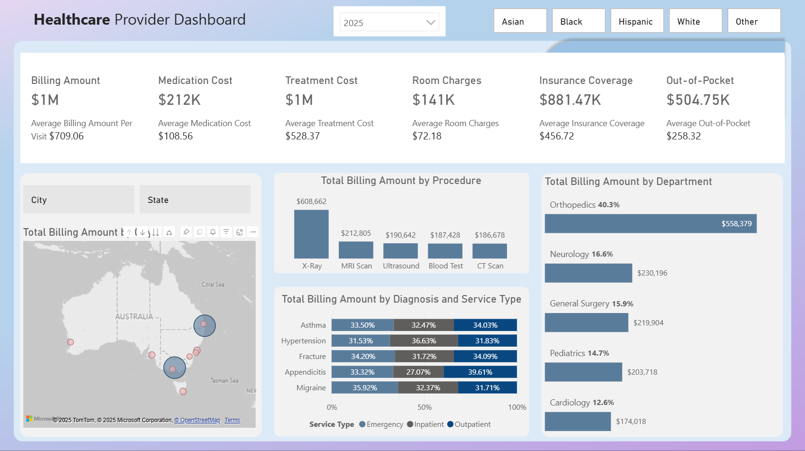

# 🏥 Healthcare Provider Dashboard (Power BI)

This interactive Power BI dashboard visualizes healthcare billing data across Australian cities, procedures, departments, and demographics. It provides insights into treatment costs, insurance coverage, and patient out-of-pocket expenses, with dynamic filtering by year and ethnicity.

Designed for hospital administrators, policy analysts, and health service researchers to:
- Benchmark costs by procedure and department
- Understand disparities in care costs across demographic groups
- Explore regional variation in healthcare spending

---

## 📊 Key Features

- **Interactive KPI cards** summarizing:
  - Billing amount, treatment & medication cost
  - Insurance coverage & out-of-pocket burden
- **City-level heatmap** of billing distribution across Australia
- **Drilldown bar charts** for:
  - Procedure-wise billing totals
  - Department contribution breakdown
  - Service type breakdown by diagnosis (Emergency, Inpatient, Outpatient)
- **Demographic filter buttons** by race/ethnicity
- **Year selector** for longitudinal comparison

---

## 🧪 Sample Insight

> *Orthopedics accounts for over 40% of total billing in 2025, with average treatment costs surpassing all other departments.*

---

## ⚠️ Data Notice
This dashboard uses **synthetic or anonymized data** modeled on UK healthcare cost structures and mapped to Australian cities for demonstration purposes only. No real patient data is included.

---

## 📌 Author

**Suleman**  
PhD in Biomedical Engineering | Data Scientist   
Email: SulemanRasheedEngr@gmail.com

---

## 📄 License
This project is open for educational and portfolio use. Attribution appreciated.
